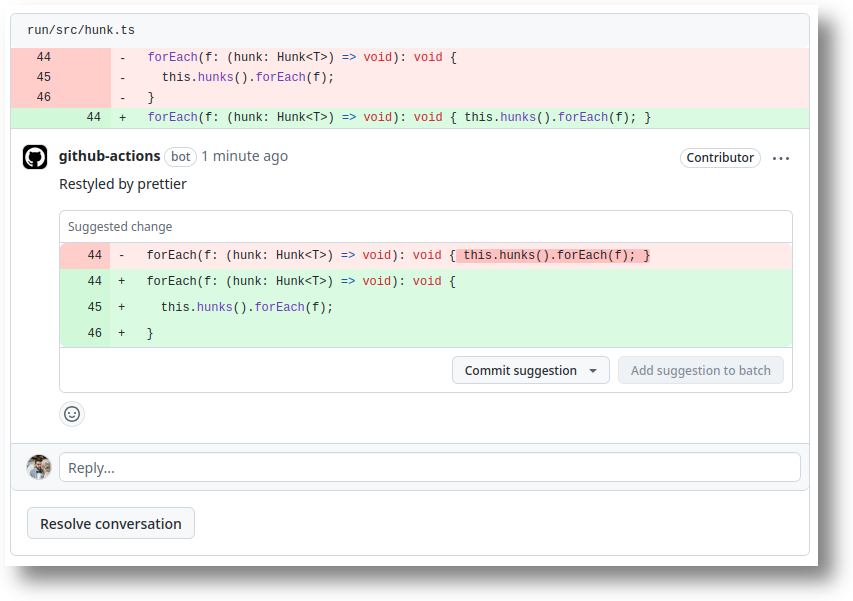

# Restyled Actions

## Usage Examples

The [`restyle` CLI][restyler] is meant to one thing and do it well: re-format
files according to configuration and commit any changes. The actions in this
repository are for installing the CLI, running it, and exposing its results such
that other, non-restyled actions can be used to do useful things. Below are
example workflows for doing such things.

[restyler]: https://github.com/restyled-io/restyler#readme

In all cases, we recommend creating the workflow as `restyled.yml`, naming it
`Restyled`, and using `concurrency` to cancel redundant jobs:

```yaml
# .github/workflows/restyled.yml

name: Restyled

on:
  pull_request:

concurrency:
  group: ${{ github.workflow }}-${{ github.ref }}
  cancel-in-progress: true
```

The workflows described here are meant to be combined and extended.

### Status Check

**Good for**: users who want CI to fail on style issues.


```yaml
jobs:
  restyled:
    runs-on: ubuntu-latest
    steps:
      - uses: actions/checkout@v4
      - uses: restyled-io/actions/setup@v4
      - uses: restyled-io/actions/run@v4
        with:
          fail-on-differences: true
```

> [!NOTE]
> If combining `fail-on-differences` with other examples below, make sure you
> update the conditions on later steps that should run when differences are
> found (but not if restyler errors):
>
> ```yaml
> if: ${{ !cancelled && steps.restyler.outputs.success == 'true' }}
> ```

### Code Suggestion Comments

**Good for**: PRs (including forks) with a low number of style issues, probably
because the team size is small and everyone has an effective local editor setup.



```yaml
jobs:
  restyled:
    runs-on: ubuntu-latest
    steps:
      - uses: actions/checkout@v4
      - uses: restyled-io/actions/setup@v4
      - uses: restyled-io/actions/run@v4
        with:
          suggestions: true
```

See also: `inputs.suggestions-limit`, `outputs.suggestions-skipped`.

### Upload Patch Artifact

**Good for**: users who are not using _Code Suggestion Comments_ and expect
contributions in forks (where _Sibling PRs_ cannot be used).


```yaml
jobs:
  restyled:
    runs-on: ubuntu-latest
    steps:
      - uses: actions/checkout@v4
      - uses: restyled-io/actions/setup@v4

      - id: restyler
        uses: restyled-io/actions/run@v4

      - if: ${{ steps.restyler.outputs.git-patch }}
        run: |
          cat >>/tmp/restyled.diff <<'EOM'
          ${{ steps.restyler.outputs.git-patch }}
          EOM

      - id: upload
        uses: actions/upload-artifact@v4
        with:
          path: /tmp/restyled.diff
          if-no-files-found: ignore
          overwrite: true

      - if: ${{ steps.upload.outputs.artifact-url }}
        run: |
          cat >>"$GITHUB_STEP_SUMMARY" <<'EOM'
          ## Restyled

          To apply these fixes locally,

          1. Download [this patch artifact](${{ steps.upload.outputs.artifact-url }})
          2. Unzip it: `unzip artifact.zip`
          3. Apply it: `git am < restyled.diff`

          EOM
```

### Sibling PRs

**Good for**: non-fork PRs with a high number of style issues, so merging them
all as a single Sibling PR is better than triaging _Code Suggestion Comments_.


```yaml
jobs:
  restyled:
    runs-on: ubuntu-latest
    steps:
      - uses: actions/checkout@v4
        with:
          ref: ${{ github.event.pull_request.head.ref }}

      - uses: restyled-io/actions/setup@v4

      - id: restyler
        uses: restyled-io/actions/run@v4

      - uses: peter-evans/create-pull-request@v7
        with:
          base: ${{ steps.restyler.outputs.restyled-base }}
          branch: ${{ steps.restyler.outputs.restyled-head }}
          title: ${{ steps.restyler.outputs.restyled-title }}
          body: ${{ steps.restyler.outputs.restyled-body }}
          labels: "restyled"
          reviewers: ${{ github.event.pull_request.user.login }}
          delete-branch: true
```

#### Handling Forks

If you expect PRs from forks, sibling PRs are not possible. You should skip
them:

```diff
 jobs:
   restyled:
+    if: ${{ github.event.pull_request.head.repo.full_name == github.repository }}
     runs-on: ubuntu-latest
```

Optionally, add a separate job for forks that does something else:

```yaml
  restyled-fork:
    if: ${{ github.event.pull_request.head.repo.full_name != github.repository }}
    runs-on: ubuntu-latest
    steps:
      - uses: actions/checkout@v4
      - uses: restyled-io/actions/setup@v4
      - uses: restyled-io/actions/run@v4
        with:
          fail-on-differences: true
```

#### Cleaning Up

If you elect not to merge a sibling PR, it will remain open. One option for
cleaning up is to run this workflow on closed events:

```diff
 on:
   pull_request:
+    types:
+      - opened
+      - reopened
+      - synchronize
+      - closed
```

Ensure you don't run the usual jobs for that action:

```diff
 jobs:
   restyled:
-    if: ${{ github.event.pull_request.head.repo.full_name == github.repository }}
+    if: |
+      github.event.action != 'closed' &&
+      github.event.pull_request.head.repo.full_name == github.repository

    runs-on: ubuntu-latest
```

```diff
   restyled-fork:
-    if: ${{ github.event.pull_request.head.repo.full_name != github.repository }}
+    if: |
+      github.event.action != 'closed' &&
+      github.event.pull_request.head.repo.full_name != github.repository

     runs-on: ubuntu-latest
```

And run a clean-up job instead:

```yaml
  restyled-cleanup:
    if: ${{ github.event.action == 'closed' }}
    runs-on: ubuntu-latest
    steps:
      - uses: restyled-io/actions/setup@v4
      - id: restyler
        uses: restyled-io/actions/run@v4
      - run: gh pr close "$BRANCH" --delete-branch || true
        env:
          BRANCH: ${{ steps.restyler.outputs.restyled-head }}
          GH_TOKEN: ${{ github.token }}
```

## Workflow Permissions

The Restyled actions themselves require no permissions. However, `contents:read`
is required for `actions/checkout` and `pull-requests:write` is required for
`peter-evans/create-pull-request`, which are both used above.

Default permissions for workflows can be adjusted in your repository settings,
or a `permissions` key can be used in the workflow itself. For more details, see
the [documentation][permissions-docs].

[permissions-docs]: https://docs.github.com/actions/reference/authentication-in-a-workflow#modifying-the-permissions-for-the-github_token

## License

This software is licensed AGPLv3. See [COPYING](./COPYING).
